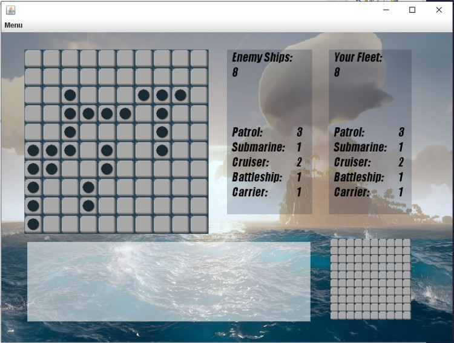

# Battleship Game

## Team Members:
- Hanzhao Yu
- Holland Delany
- Jorge Corrales

## 1. How to run
To start the game, download **battleship.jar** and click on the file. 

You may also run **battleship.jar** from the command line. Simply navigate to the target directory and execute:  ``java -jar battleship.jar``

Alternatively, import the source files from this repository and run the **Main.java** class.

If you successfully installed the game it will show the following window:

## 2. How to Play

#### Description
In this game you are playing versus the computer in a battleship combat. Your objective is to sink the computer's fleet before it sinks yours.

Each fleet will have eight ships:

- 3 patrols (two square long)
- 1 submarine (three square long)
- 2 cruiser (three square long)
- 1 battleship (four square long)
- 1 carrier (five square long)

#### The Boards
When playing you will see two boards:

- In the top left corner you will have the computer's board, that is the one you are aiming at.
- In the bottom right corner you will have your board, there is where the computer is aiming at.

To attack,choose a square on your opponent's board.  The squares can take the following values:

- Light gray square: The position has not been attacked.
- Dark gray square: Rapid Fire Mode only: The position has been selected for attack, but the shot has not yet been made.
- Translucent square: The position has been attacked, but it was empty/ no ship was found.
- Explosion square: The position has been attacked, a ship in this position was hit, but the ship is still floating.
- Red flagged square: The position has been attacked, and the ship located in this square has been sunk.

#### Tracking the game

You can track the progress of the game by viewing the ships inventory in the top right corner. The inventory shows the total number or ships floating with designated ship types.

The second way to track the game is in bottom left console that will narrate the changes in the status of the squares.

#### Menu

When clicking on **Menu** the player will be prompted with three options:

- Unhide Ships: this will reveal all of the opponent's ships, but will not terminate the game.

- Restart: this will take the user back to the main screen to choose the gaming mode.
- Quit: this will close the entire application.

## 3. Gaming Modes

The game has five different modes that are explained below.

#### Standard Game

-  In this classic game mode, each player has one shot per turn. The user will make the first move.

#### Ships on the Run

-  In this extreme version of the classic game, the ships will move and recover from the shots if they hit but are not sunk within a designated number of turns (dependent on the size of the ship).

#### Bombs Away!

- In this mode, the user has an specific quantity of bombs (3) that can be used at any point during the game. If a ship is hit by a bomb it will immediately be sunk.

#### Rapid Fire

- Rapid fire mode allows the user to choose multiple squares to hit in one turn, with the quantity of available shots equal to the number of ships that the opponent has remaining. The player will make the shots without knowing what impact they had until the end of the turn.

#### Lucky Shot

- If you miss several shots in a row, computer assist will be enabled to help you to find a target. The likelihood of computer assist hitting a target increases proportionally to the amount of misses in a row.

